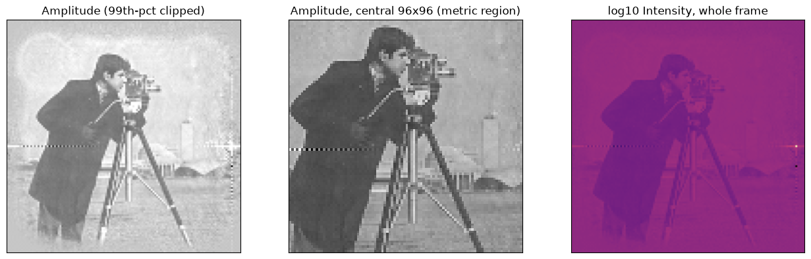
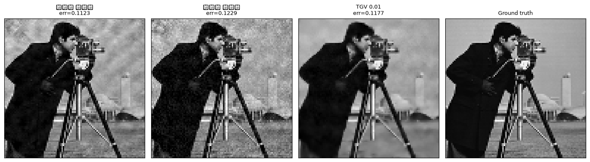
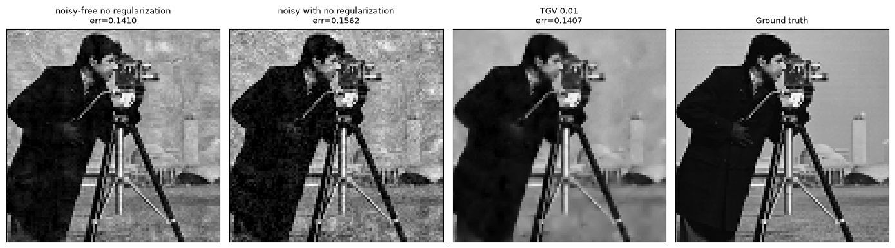
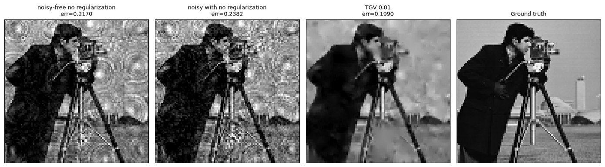
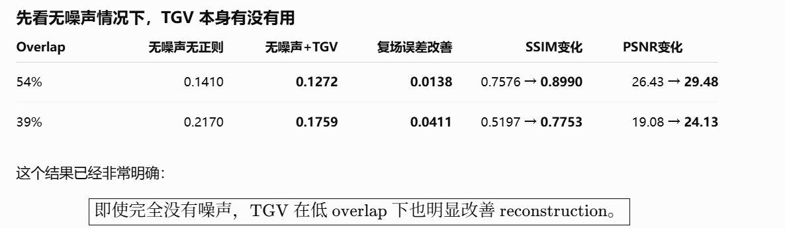

1. pure mean kurtosis, with lr 1e-5: 

2. 泊松噪声光子数1000仿真, 无噪声 vs 有噪声: 

3. 噪声加54%重叠率： 

4. 噪声加39%重叠率： 

# TGV 在低剂量 + 低重叠率 Ptychography 中的作用

## 1. 实验目的

验证在低剂量 Poisson 噪声条件下，随着 ptychography 扫描重叠率降低，TGV 正则化是否能够提高 AD-based ptychography 的重建稳定性。

本组实验固定：

- `PEAK_PHOTONS = 1000`
- TGV 权重：`beta = 0.01`
- `REG_CROP = 16`
- `stages = 8`
- 其余模型和训练设置保持一致

改变扫描重叠率：

- 63%
- 54%
- 39%

每个重叠率目前比较：

1. 无噪声 + 无正则
2. 有噪声 + 无正则
3. 有噪声 + TGV

## 结论 1：低重叠率本身会明显恶化重建

即使完全没有加入噪声，无正则结果仍然随着 overlap 降低而明显恶化：

\[
0.1123
\rightarrow
0.1410
\rightarrow
0.2170
\]

对应：

\[
63\%
\rightarrow
54\%
\rightarrow
39\%
\]

说明 ptychography 的扫描重叠率下降后，measurement redundancy 减少，数据本身对 object 的约束能力明显下降。

因此：

\[
\boxed{
\text{低 overlap 会使 inverse problem 更加 ill-conditioned}
}
\]

---

## 结论 2：低剂量噪声会进一步放大低重叠率下的不稳定性

加入 Poisson noise 后，所有 overlap 条件下 reconstruction 都进一步变差。

而且随着 overlap 降低，噪声造成的额外误差也增加：

\[
0.0116
\rightarrow
0.0152
\rightarrow
0.0212
\]

说明低重叠率和低光子数共同降低了数据约束能力。

---

## 结论 3：TGV 在低剂量情况下能够稳定改善重建

在三个 overlap 条件下，加入 TGV 后均观察到：

- 复场误差下降
- SSIM 提升
- PSNR 提升
- Probe error 总体下降

因此可以确认：

\[
\boxed{
\text{TGV 在 noisy ptychographic reconstruction 中具有稳定的正则化作用}
}
\]

---

## 结论 4：Overlap 越低，TGV 的作用越明显

TGV 的复场误差改善量：

\[
0.0077
\rightarrow
0.0155
\rightarrow
0.0392
\]

随着 overlap 从 63% 降低至 39%，TGV 的收益明显增强。

这说明 TGV 的主要价值并不是在理想、信息充分的数据条件下提高重建，而是在：

- measurement noise 较强
- overlap 较低
- 数据 redundancy 不足
- inverse problem 更加 ill-conditioned

的情况下稳定 reconstruction。

可以概括为：

\[
\boxed{
\text{The benefit of TGV increases as the ptychographic inverse problem becomes more ill-conditioned.}
}
\]

# 6. 当前实验支持的核心研究结论

当前结果支持以下判断：

> 在高重叠率、数据条件良好的 ptychography 中，data fidelity 本身已经能够较好约束 reconstruction，因此 TGV 的必要性有限。
>
> 随着 photon count 降低和 scan overlap 减少，measurement redundancy 和有效数据约束逐渐下降，无正则的 AD reconstruction 更容易受到噪声和不适定性的影响。
>
> 在这些更困难的 measurement regimes 下，TGV 能够显著抑制 noise fitting 并稳定 object reconstruction，而且其收益随着 overlap 降低而明显增加。

---

高 overlap
data redundancy 强
↓
data fidelity 已经足够约束 reconstruction
↓
TGV 收益较小

低 overlap
data redundancy 弱
↓
solution ambiguity / instability 增强
↓
TGV 提供额外 structural prior
↓
重建明显改善

